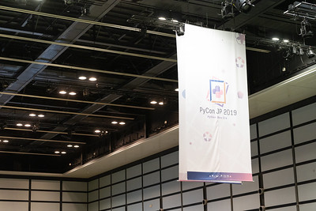
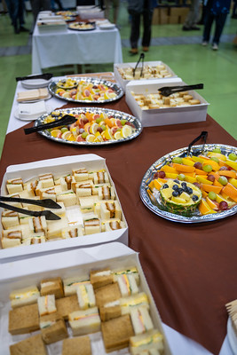

.. image-samples documentation master file, created by
   sphinx-quickstart on Mon Jul 29 19:02:46 2024.
   You can adapt this file completely to your liking, but it should at least
   contain the root `toctree` directive.

image-samples documentation
===========================

image as a link
---------------

figure directive
^^^^^^^^^^^^^^^^

image directive
^^^^^^^^^^^^^^^

